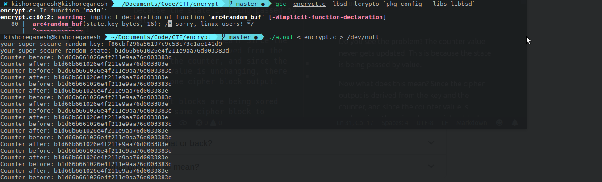

AESThetics was one of my favorite challenges.

We are given two files (encrypt.c) and (secret-flag.png.crypt) and have to find the flag. We know that the file is a PNG and that it has been encrypted using AES, but we don't know the key.

Initially I didn't have any idea about how to approach this problem. From my elementary knowledge of cryptography, I had initially thought it would be some variant of a AES cryptanalysis problem which is why I had set it aside since I didn't have much knowledge about that.

I was looking up the function arc4_random_buf which is used to generate a random buffer and went down this wrong rabbit hole where I thought I had to exploit the fact that it was pseudorandom so that I can somehow predict the key (since the Wikipedia for RC4 was peppered with warnings about its predictability). Of course this was wrong off the bat.

Later, I looked at the code once again and saw that it was pretty simple: 
It generates a random key of 16 bytes and a random counter value.

Here the AES Cipher is operating in CTR Mode, i.e the input is not encrypted through the cipher directly. (So thankful that this came in the semester this is a part of my course 😆)

Source: Wikipedia

Output = (Encrypt(Key, Counter)) ^ Input block

The code encrypts the input 16 bytes at a time, with the remaining bytes (if any) being padded with zeroes and encrypted.

The output file consists of the 16 byte counter value followed by the encrypted bytes/

It read from 0 (input), encrypted it in blocks of 16, calling the function inc_counter each time to increment the counter and writes the output block to 1 (output).

It is here that I resorted to my favorite tool: print statements. I had a hunch that it was probably the inc_counter part that was buggy, since I didn't recognize its implementation and since it was calling a library function to encrypt the AES block, which is probably correct. I added a print statement at the end to see the counter value.

<image of same counter>

Do you see the problem? The counter value never gets updated. 
`struct ctr_state {
	uint8_t key_bytes[16];
	uint8_t counter[16];
};`

The state being passed to the encrypt function has the above format.

`ctr_block_encrypt(struct ctr_state state, uint8_t *in, uint8_t *out)`

If you look at the function signature, the problem is apparent: State is being passed by value. Thus the counter inside the state gets copied and the original state is never modified.

Now what does this mean? Since the cipher output is derived from the key and the counter, and since the counter value is unchanging, there is only one cipher block output.

All input blocks are being xored with the same cipher block to produce the output block.

This means that if we had some known input block, then we can figure out the cipher block, since:

Output_Block = (Input_Block ^ Cipher_Block)

Output_Block ^ Input_Block = (Input_Block ^ InputBlock ^ Cipher_Block) = Cipher_Block

Of course the problem of having a known input still remains. This is where we exploit the fact that it is a PNG.

I had a feeling that there'll be some known bytes in the PNG structure. I took a look at Wikipedia, and bam, there is a known 8 byte signature: `89 50 4E 47 0D 0A 1A 0A`

However, we need 16 bytes of known input.

I explored the Wikipedia page some more, and found that a PNG file is divided into blocks with each block having the following structure:

The first block of a PNG file is always the IHDR block. It contains the height, width and other info, but more importantly its length is known (13 bytes).

Thus we know the first 4 bytes (the length) and the next 4 bytes (the IHDR type).

Thus we know the first 16 bytes of the input file which would be common to any PNG.

Now we just XOR this with the output to get the cipher block.

To get the other input blocks, we just XOR the corresponding block with the cipher block we just obtained.

Output_Block ^ Cipher_Block = Input_Block ^ Cipher_Block ^ Cipher_Block = Input_Block

## Code

Now we have the concept out of the way, just need to implement it. I just modified the encrypt.c file for a quick and dirty fix.

    #include <stdint.h>
    #include <stdio.h>
    #include <stdlib.h>
    #include <string.h>
    #include <unistd.h>
    #include <openssl/aes.h>

    #define SZ 5532

    /* helper to print hex strings */
    void
    print_hex(uint8_t *buf, size_t len)
    {
        for (size_t i = 0; i < len; i++) {
            fprintf(stderr, "%02x", buf[i]);
        }
        fprintf(stderr, "\n");
    }

    /* helper to increment the 128-bit counter */
    void
    inc_counter(uint8_t *counter)
    {
        uint8_t *pos = counter + 15;
        while (pos > counter) {
            if (++(*pos) != 0x00) {
                return;
            }
            pos--;
        }

        (*pos)++;
    }

    void xor_block(uint8_t* out, uint8_t* in){
        for (int i = 0; i < 16; i++) {
            out[i]^=in[i];
        }
    }

    int
    main(int argc, char **argv)
    {
        
        uint8_t c1[16];
        read(0, c1,16); // copy counter values;
        print_hex(c1, 16);

        uint8_t png_signature[8] = {0x89,0x50,0x4E,0x47,0x0D,0x0A,0x1A,0x0A}; //Known PNG signature
        uint8_t header_known[8] = {0x00,0x00,0x00,0x0D,0x49,0x48,0x44,0x52}; //Known first block
        uint8_t last_known[16] = {0x00, 0x00,0x00,0x00,0x49,0x45,0x4E,0x44,0xAE,0x42,0x60,0x82, 0x00,0x00,0x00,0x00}; //Last 12 bytes, for convenience
        uint8_t starting_known[16]; 
        memcpy(starting_known, png_signature, 8);
        memcpy(starting_known+8, header_known, 8); //Concatenating two buffers (redundant)
        

        uint8_t buffer[SZ];
        read(0, buffer, SZ); // Reading encrypted input into buffer
        uint8_t starting_known_cipher[16];
        memcpy(starting_known_cipher, buffer, 16); //Copying first 16 bytes of encrypted input
        
        fprintf(stderr,"Starting known cipher: ");
        print_hex(starting_known_cipher, 16);
        xor_block(starting_known_cipher, starting_known); //Starting_Known_Cipher now contains the common cipher block

        int f = 0;
        int sz = SZ/16;

        for(int i = 0; i < sz; i++){
            uint8_t out[16];
            memcpy(out, &buffer[i*16], 16);
            print_hex(c1, 16);
            xor_block(out, starting_known_cipher); //Decrypt other blocks
            write(1, out, 16); 
        }

        write(1, last_known, 12);	
        return 0;
    }

Once we decrypt the image using the above code, we get the flag ^.^

    
 Spoiler Warning 

    

## Failed attempt
I had initially misinterpreted the output as showing that there are two counter values that are being used alternatively. This was from my initial hunch that the flaw was in the implementation of the inc_counter itself. 

Thus I had inadvertently solved a harder version of the problem: What if two cipher blocks are being used alternatively? 

In this case, we have already found the first cipher block, but we still need to find the second one, for which we need 16 more bytes of known input.

The output file is 5548 bytes. Without the 16 byte counter value, it is 5532 bytes.

5532 / 16 ~ 345 blocks
5532 % 16 = 12
The left over block (12 bytes) would be the last block. We know from the implementation that it'll be padded with zeroes, so we know the last 4 bytes.

Here is where the PNG structure saves the day again, the PNG file ends with the IENDBlock. It is of zero size, its type bytes are known and its CRC is also known (since there is no data). Thus we also know the last 16 bytes.

Of course this is useless since in the actual problem we need only one cipher block, and this is why my initial attempt gave a malformed decrypted png.

Once I ignored the second block, it worked fine.

Lesson: In modes of operation where you don't directly operate on the input, if your pseudo input values are not random an attacker may exploit some known details such as the file structure.
